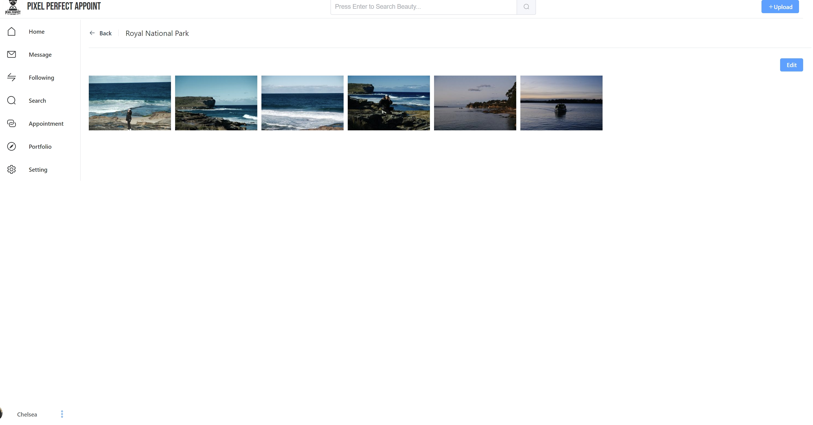
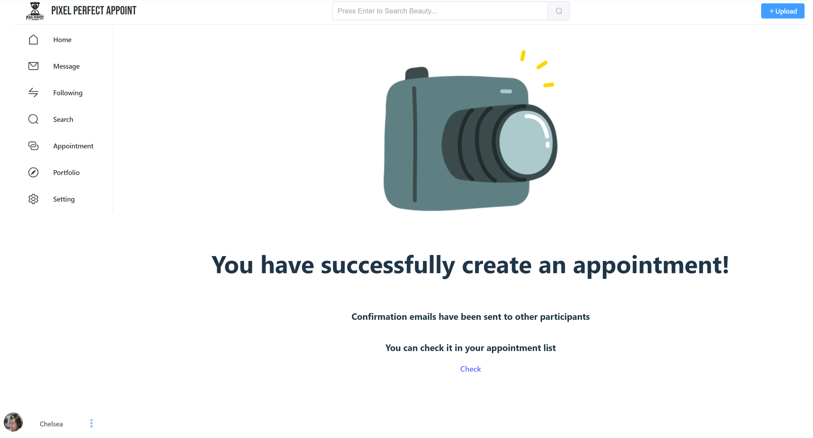
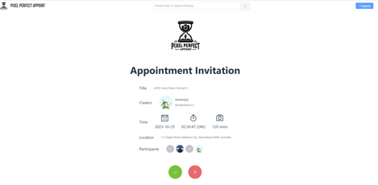

# ELEC5619-2023-S2-G36-PerfectPixelAppoint-web

**This is the front-end code repository for Group 36's assignment of ELEC5619 UoS in USYD 2023 S2.**

## 1 Requirements

| No. | Requirement | Description | Version | Required |
| --- | --- | --- | --- | --- |
| 1 | Node.js | Node.js together with npm | 18.14.1 | Yes |
| 2 | Chromium-based browser | Chromium-based browser (e.g. Google Chrome, Microsoft Edge, Brave Browser, etc.) | browsers with native ES2015 support | Yes |
| 3 | Nginx | Used as a web container in prodution mode | 1.24.0 | Required in production mode |

## 2 Libraries Dependencies

| No. | Category | Library | Description | Version |
| --- | --- | --- | --- | --- |
| 1 | Vue | vue | Framework | 3.3.4 |
| 2 | Vue | vue-router | Router | 4.2.4 |
| 3 | Vue | vuex | State management | 4.1.0 |
| 4 | Vue | vue-axios | Axios wrapper for Vue | 3.2.6 |
| 5 | Components | element-plus | UI components | 2.3.12 |
| 6 | Components | element-plus/icons-vue | Icons | 2.1.0 |
| 7 | Components | icon-park/vue-next | Icons | 1.4.2 |
| 8 | Components | flag-icon-css | Nations flag icons | 4.1.7 |
| 9 | Utilities | axios | HTTP client | 1.5.0 |
| 10 | Utilities | country-telephone-data | Country telephone data | 0.6.1 |
| 11 | Utilities | dayjs | Date and time management | 1.11.9 |
| 12 | Utilities | moment | Date and time management | 2.29.4 |
| 13 | Utilities | validator | Validation | 13.11.0 |
| 14 | Utilities | imagesloaded | Image loading | 5.0.0 |
| 15 | Utilities | masonry-layout | Masonry layout implementation | 4.2.2 |
| 16 | Google SDK | googlemaps/js-api-loader | Google Maps JavaScript API loader | 1.2.1 |
| 17 | Build | vite | Build tool | 4.4.5 |
| 18 | Build | vitejs/plugin-vue | Vue 3 plugin for Vite | 4.2.3 |
| 19 | Build | vite-plugin-rewrite-all | Rewrite all URLs in Vite | 1.0.1 |

## 3 Installation (development mode)

1. Clone the repository to your local machine.
2. Open a terminal and navigate to the repository.
3. Run `npm install` to install the dependencies.
4. Config SERVER_HOST variable in /public/public.config.js which is the host of the server-side application. E.g., ```$PUBLIC.SERVER_HOST=http://localhost:8080```.
5. Run `npm run dev` to start the server in development mode.
6. Record the URL shown in the terminal, which should be configured in server-side application related to email functionalities (the links in emails). E.g. (by default), ```app.web.url-prefix=http://localhost:5173/``` in server ```application.properties``` file.
7. Deloy the server-side application following the Readme file in the server-side repository.
8. Open a Chromium-based browser and navigate to the URL shown in the terminal.

## 4 Installation (production mode)

1. Clone the repository to your local machine.
2. Open a terminal and navigate to the repository.
3. Run `npm install` to install the dependencies.
4. Config SERVER_HOST variable in /public/public.config.js which is the host of the server-side application. E.g., ```$PUBLIC.SERVER_HOST=http://localhost:8080```.
5. Run `npm run build` to build the project.
6. Copy the content of ```.dist``` folder to a new folder as the root directory of nginx server.
7. Create a new .conf file under nginx configuration folder. E.g., ```/etc/nginx/conf.d/ppa_web.conf``` in Linux/Unix system or ```C:\nginx\conf\ppa_web.conf``` in Windows system.
8. Wrire the following content (you can change port if you wish) in the .conf file. Note that the ```root``` should be the path of the folder created in step 6. Here is an example:

    ``` nginx
    server {
        listen 3000; 
        server_name localhost;
        root D:/Workspace/old-phone-deals-web/;
        index index.html;
        location / {
            try_files $uri $uri/ /index.html;
        }
    }
    ```
    ``` nginx
    server {
        listen 3000;
        server_name localhost;

        # ssl config
        # listen 443 ssl;
        # ssl_certificate /etc/ssl/certs/www.pixelperfectappoint.cc_bundle.crt;
        # ssl_certificate_key /etc/ssl/private/www.pixelperfectappoint.cc.key;
        # server_name www.pixelperfectappoint.cc;

        root /home/andy/docker-space/ppa/ppa-web;
        index index.html;
        location / {
            try_files $uri $uri/ /index.html;
        }
        error_page 404 /index.html;
    }
    ```


9. Make sure this conf file is included in the .conf file in nginx.conf. (By defaul, *.conf in conf.d will be included). If not, include the .conf file, E.g., ```include /etc/nginx/conf.d/ppa_web.conf;``` in Linux/Unix system or ```include C:\nginx\conf\ppa_web.conf;``` in Windows system. Here is an exmaple:

    ``` nginx
    # ...
    http {
        include       ppa_web.conf;
        # ...
    }
    # ...
    ```
10. start nginx server. Try to access the home page of the application in a Chromium-based browser. E.g., ```http://localhost:3000```. If you can see the home page, the installation is successful. (it is normal that you cannot see the content of pages because the server-side application is not deployed yet.)
11. Record the URL shown in the terminal, which should be configured in server-side application related to email verification functionalities. E.g. (by default), ```app.web.url-prefix=http://localhost:3000/``` in server ```application.properties``` file.
12. Deloy the server-side application following the Readme file in the server-side repository.
13. Try to access the home page again. If you can see the content of the home page, the installation is successful.

## 5 Functionalities

**The functionalities section is quite similar to the functionalities and presentation layer sections in the submitted final report. Just use the report sections and screenshots**


### 5.1 Account-related pages
#### 5.1.1 User sign up page
  
Users can register an account through this page. This page will check if the user has filled in all required fields, verify the format of the phone number and email address, assess password strength, and check if the user alias is already being used by another user. If users alreadey have an account, they can click on the "Sign in" button to go to the login page. (Fig 5.1.1) 

<p align="center">
  <br>
  <div align="center">Fig 5.1.1 User sign up page</div>
</p>

#### 5.1.2 Notification page (active account)
It is a reminder page that reminds users to check their email and activate their account. 

It can be redirected to the login page.
<p align="center">
  <br>
  <div align="center">Fig 5.1.2 Reminder to activate account page</div>
</p>

#### 5.1.3 Successfully activated page
It is a reminder page that reminds users their account has been successfully activated (Fig 5.1.3). 

It can be redirected to the login page.
<p align="center">
  <br>
  <div align="center">Fig 5.1.3 Successfully activated page</div>
</p>

#### 5.1.4 User login page
Users can log in to their account through this page. This page will check if the user has filled in all required fields, verify the email address and password If users do not have an account, they can click on the "Sign up" button to go to the sign up page. (Fig 5.1.4)

<p align="center">
  <br>
  <div align="center">Fig 5.1.4 User login page</div>
</p>


#### 5.1.5 Notification page (User log out)
It is a reminder page that reminds users are log out successfully.

It can be automatically redirected to the login page (Fig 5.1.5).
<p align="center">
  <br>
  <div align="center">Fig 5.1.5 User log out</div>
</p>

#### 5.1.6 User fogot password page
Users can reset their password through this page. 

User should input their email address. and reset the password through the link sent to the email address. (Fig 5.1.6)

<p align="center">
  <br>
  <div align="center">Fig 5.1.6 User fogot password page</div>
</p>

#### 5.1.7 Notification page (no token)
It is a reminder page that reminds users to use the link sended to email to reset password.(Fig 5.1.7)

<p align="center">
  <br>
  <div align="center">Fig 5.1.7 Notification page (no token)</div>
</p>

#### 5.1.8 User reset password page
Users can reset their password through this page.

User should confirm the password and then reset the password. (Fig 5.1.8)

<p align="center">
  <br>
  <div align="center">Fig 5.1.8 User reset password page</div>
</p>

#### 5.1.9 Notification page (reset password successfully)
It is a reminder page that reminds users to reset password successfully.

It can jump to the login page. (Fig 5.1.9)

<p align="center">
  <br>
  <div align="center">Fig 5.1.9 Reset password successfully</div>
</p>

### 5.2 Posts Function related pages

#### 5.2.1 User view all posts

User can view all posts on Posts tab. (Fig 5.2.1)
<p align="center">
  <br>
  <div align="center">Fig 5.2.1 User create posts</div>
</p>

#### 5.2.2 User create posts

Users can upload posts on any page. User upload posts by choosing the posts in popup. (Fig 5.2.2-1)

Users can choose to browse the posted posts in chronological or reverse chronological order.
<p align="center">
  <br>
  <div align="center">Fig 5.2.1-1 User view all posts</div>
</p>

Users can fill the content of posts and choose the photos they want to upload.
Users can change the cover image by clicking the uploaded photo. (Fig 5.2.2-2)

<p align="center">
  <br>
  <div align="center">Fig 5.2.2-2 Posts' detail</div>
</p>

#### 5.2.3 User edit posts
User can edit posts in *View Posts Page*, and delete/add photos, edit the title and content of posts. (Fig 5.2.3-1)

<p align="center">
  <br>
  <div align="center">Fig 5.2.3-1 User edit posts</div>
</p>
Users can confirm update or cancel update. (Fig 5.2.3-2)
<p align="center">
  <br>
  <div align="center">Fig 5.2.3-2 User edit posts confirm</div>
</p>

#### 5.2.4 User browsing one specific post
User can view one specific post by clicking the post's name in *View Posts Page*. (Fig 5.2.4)

Users can see the comments on the current post.

Users can publish comments.

Users can *like* the post they are currently browsing.

Users can share the post they are currently browsing.

<p align="center">
  <br>
  <div align="center">Fig 5.2.4 User browsing one specific post</div>
</p>

### 5.3 Portfolio/Photo Funtion related pages

#### 5.3.1 User view all portfolio
Users can enter the portfolio page through the left navigation bar to view all published portfolios.

Users can create a new portfolio on this page.

User can change the privacy status of the portfolio by clicking the eye button.

User can delete the portfolio by clicking the delete button (Fig 5.3.1-1).


<p align="center">
  <br>
  <div align="center">Fig 5.3.1-1 User view portfolio</div>
</p>


Users can modify the privacy status of this portfolio by clicking the eye button, and choose whether to modify the private/public status of the photos in the portfolio. (Fig 5.3.1-2) (Fig 5.3.1-3)

<p align="center">
  <br>
  <div align="center">Fig 5.3.1-2 Modify privacy of porfolio</div>
</p>

<p align="center">
  <br>
  <div align="center">Fig 5.3.1-3 Modify privacy of photos in porfolio</div>
</p>

Users can delete a specific portfolio by clicking the delete button on the portfolio, this operation will not delete the photos in this portfolio(Fig 5.3.1-4)

<p align="center">
  <br>
  <div align="center">Fig 5.3.1-4 Delete portfolio</div>
</p>


#### 5.3.2 User create portfolio
Users Users can select and create portfolio from the uploaded photos. (Fig 5.3.2-1)

Users can set portfolios as public/private.

Users can set any photo as the portfolio's cover image.

Users can set the title and description of the portfolio.

<p align="center">
  <br>
  <div align="center">Fig 5.3.2 User create portfolio</div>
</p>

#### 5.3.3 User view and edit portfolio
Users can view one specific portfolio's photos by clicking the portfolio's coverpage and name in *Portfolio card*. 

Users can go back to the previous page.(Fig 5.3.3-1)
<p align="center">
  <br>
  <div align="center">Fig 5.3.3-1 User view one specific portfolio</div>
</p>

Users can edit the information of the current portfolio, including modifying the title, description, cover photo, and included photos. (Fig 5.3.3-2)
<p align="center">
  <br>
  <div align="center">Fig 5.3.3-2 User edit portfolio</div>

#### 5.3.4 User view one specific photo in portfolio

Users can view one specific photo in portfolio by clicking the photo in * one sepecific Portfolio Page*. (Fig 5.3.4-1)

User can check the detail of this photo. (Fig 5.3.4-2)

User can add comments to this photo, it will redirect to the comments page (Fig 5.3.4-3).

User can like this photo.

User can close this photo view page

<p align="center">
  <br>
  <div align="center">Fig 5.3.4-1 One specific photo in portfolio</div>
</p>

<p align="center">
  <br>
  <div align="center">Fig 5.3.4-2 Photo detail</div>
</p>

<p align="center">
  <br>
  <div align="center">Fig 5.3.4-3 Add comment</div>
</p>

#### 5.3.5 User view all photos page
Users can view all photos on *Portfolio/Photos* tab. (Fig 5.3.5-1)
<p align="center">
  <br>
  <div align="center">Fig 5.3.5 User view all photos</div>
</p>

#### 5.3.6 User upload photos
Users can upload photos on *view all photos* page. 

Users can upload multiple photos at once.

Users can click on different photos and fill in photo information, including photo name, photo description, photo category, camera brand, camera model, lens model, focal length, exposure time, aperture value, ISO, and choose whether the photo is private or public. (Fig 5.3.6)

<p align="center">
  <br>
  <div align="center">Fig 5.3.6 User upload photos</div>
</p>

#### 5.3.7 User edit/delet photos

Users can bulk change the privacy settings of photos (Fig 5.3.7-1). 

<p align="center">
  <br>
  <div align="center">Fig 5.3.7-1 User change privacy</div>
</p>

Users can bulk delete photos (Fig 5.3.7-2).

<p align="center">
  <br>
  <div align="center">Fig 5.3.7-2 User delete photos</div>
</p>

### 5.4 User Appointments Function related pages

#### 5.4.1 User view all appointments
Users can view all appointments on *Appointment* tab. (Fig 5.4.1-1)

Users can see the completion status of each appointment on this page.

User can quit the appointment by clicking the red *Quit* button.

User can view all applointments in ascending or descending order according to the appointment time.

User can create a new appointment on this page.

<p align="center">
  <br>
  <div align="center">Fig 5.4.1-1 User view all appointments</div>
</p>

User can change the completion status of the appointment only when the appointment is created by the user. (Fig 5.4.1-2)

<p align="center">
  <br>
  <div align="center">Fig 5.4.1-2 User change appointment status</div>
</p>

#### 5.4.2 User create appointment
Users can create a new appointment on *Appointment* page. (Fig 5.4.1-1)

There are 3 steps to create a new appointment: Basic information, Location and Participants.

- Step 1: Basic Information: User can fill the basic information of the appointment, including the appointment title, appointment description, appointment date, appointment time. Users can set appointment durations longer than one day by using the "Tomorrow" button. e.g. Start at 9 PM and end at 6 AM the next day. (Fig 5.4.2-1)

<p align="center">
  <br>
  <div align="center">Fig 5.4.2-1 Step 1: Basic Information</div>
</p>

- Step 2: Location: 
  - Users can switch between flat/satellite map modes.(Fig 5.4.2-2) (Fig 5.4.2-3)

  
<p align="center">
  <br>
  <div align="center">Fig 5.4.2-2 Step 2: Location (flat map)</div>
</p>

<p align="center">
  <br>
  <div align="center">Fig 5.4.2-3 Step 2: Location (satellite map)</div>
</p>

  - User can search location and select location on the map. (Fig 5.4.2-4)

<p align="center">
  <br>
  <div align="center">Fig 5.4.2-4 Search and select location</div>
</p>

- Step 3: Participants
  - User can add participants to one appointment. (Fig 5.4.2-5)
  - User can search other users by email address/user name/alias/user id.
  - User can add or remove participants. (Fig 5.4.2-6)

<p align="center">
  <br>
  <div align="center">Fig 5.4.2-5 Step 3: Add participants</div>
</p>

<p align="center">
  <br>
  <div align="center">Fig 5.4.2-6 Search, add and remove participants</div>
</p>

#### 5.4.3 Notification page (create appointment successfully)
It is a reminder page that reminds users the appointment is created successfully (Fig 5.4.3).

<p align="center">
  <br>
  <div align="center">Fig 5.4.3 Create appointment successfully</div>
</p>

#### 5.4.4 User view one specific appointment

Users can view one specific appointment by clicking the appointment's title.

User can see the detail of one appointment. (Fig 5.4.4-1) 

Only the creator of the appointment can edit the appointment. (Fig 5.4.4-2)
<p align="center">
  <br>
  <div align="center">Fig 5.4.4-1 Creator view one specific appointment</div>
</p>

<p align="center">
  <br>
  <div align="center">Fig 5.4.4-2 Participant view one specific appointment</div>
</p>

#### 5.4.5 Creator edit appointment

Appointment's creator can edit the appointment in *View one specific appointment page*. (Fig 5.4.4-1)

Appointment's creator can edit the appointment's title, description, date, time, location and participants. (Fig 5.4.5-1 - Fig 5.4.5-5)

<p align="center">
  <br>
  <div align="center">Fig 5.4.5-1 Edit appointment title</div>
</p>

<p align="center">
  <br>
  <div align="center">Fig 5.4.5-2 Edit appointment description</div>
</p>

<p align="center">
  <br>
  <div align="center">Fig 5.4.5-3 Edit appointment date and time</div>
</p>

<p align="center">
  <br>
  <div align="center">Fig 5.4.5-4 Edit appointment location</div>
</p>

<p align="center">
  <br>
  <div align="center">Fig 5.4.5-5 Remove appointment participants</div>
</p>

Appointment's creator can add participants to one appointment. (Fig 5.4.5-6)

<p align="center">
  <br>
  <div align="center">Fig 5.4.5-6 Add appointment participants</div>
</p>

#### 5.4.6 Participants accept/reject appointment

Participants will receive an email with the link to the accept/reject page.

User can select accept/reject the appointment. (Fig 5.4.6-1)
<p align="center">
  <br>
  <div align="center">Fig 5.4.6-1 Accept appointment</div>
</p>

User accept appointment (Fig 5.4.6-2). 

<p align="center">
  <br>
  <div align="center">Fig 5.4.6-2 Accept appointment </div>
</p>

User reject appointment (Fig 5.4.6-3).
<p align="center">
  <br>
  <div align="center">Fig 5.4.6-3 Reject appointment</div>
</p>


#### 5.4.7 User add reviews to appointment

Both the creator and participants of the appointment can add reviews to the appointment. 

User can only give reviews to the completed appointment.

User should select person to review, and then fill in the review content and rating (Fig 5.4.7-1) (Fig 5.4.7-2).

Once published, reviews cannot be deleted (Fig 5.4.7-3).

<p align="center">
  <br>
  <div align="center">Fig 5.4.7-1 Choose the person to add reviews</div>
</p>

<p align="center">
  <br>
  <div align="center">Fig 5.4.7-2 Add reviews</div>
</p>

<p align="center">
  <br>
  <div align="center">Fig 5.4.7-3 Published reviews </div>
</p>

### 5.5 Main Page

#### 5.5.1 Main page

Users can view the main page when they sign in, there's top search bar and left navigation bar on the main page.(Fig 5.5.1-1)

<p align="center">
  <br>
  <div align="center">Fig 5.5.1-1 Main page</div>
</p>

User can access search function through the top search bar and left navigation bar. Users can filter posts, photos, and users, and search within the filtered results (Fig 5.5.1-2).
<p align="center">
  <br>
  <div align="center">Fig 5.5.1-2 Filter and Search</div>
</p>

User can access Message page through the left navigation bar.

User can access Following/Follower page through the left navigation bar.

User can access Appointment page through the left navigation bar (Shown in previous section).

User can access Portfolio/Photos page through the left navigation bar (Shown in previous section).

User can access Setting page through the left navigation bar.


User can access reviews they send and they receive (Fig 5.5.1-3).

<p align="center">
  <br>
  <div align="center">Fig 5.5.1-3 View reviews</div>
</p>

#### 5.5.2 Message page

User can view all messages on *Message* tab (Fig 5.5.2-1).
<p align="center">
  <br>
  <div align="center">Fig 5.5.2-1 View all messages</div>
</p>

Users can send messages to participants when creating an appointment, participants can also send messages to each other (Fig 5.5.2-2).
<p align="center">
  <br>
  <div align="center">Fig 5.5.2-2 Send message to participants</div>
</p>

Users can directly send messages to the users they find through search page (Fig 5.5.2-3).
<p align="center">
  <br>
  <div align="center">Fig 5.5.2-3 Send message to user</div>
</p>

#### 5.5.3 Following/Follower page

Users can view all following/follower on *Following/Follower* tab (Fig 5.5.3-1) (Fig 5.5.3-2).

Users can follow back their followers, after they follow back, the button will change to *Mutual followed* .

User can unfollow their following, after they unfollow, that user wil be moved from user's following list.

<p align="center">
  <br>
  <div align="center">Fig 5.5.3-1 View all following</div>
</p>

<p align="center">
  <br>
  <div align="center">Fig 5.5.3-2 View all follower</div>
</p>

#### 5.5.4 Setting page

Users can view their profile on *Setting* tab (Fig 5.5.4-1).

<p align="center">
  <br>
  <div align="center">Fig 5.5.4-1 View profile</div>
</p>

User can visit their own profile page.

User can change password.

Users can permanently delete their accounts. This operation requires users to confirm twice (Fig 5.5.4-2).
<p align="center">
  <br>
  <div align="center">Fig 5.5.4-2 Delete account</div>
</p>

### 5.6 User Profile Pages

#### 5.6.1 User view profile

- User view their profile: User can view profile by clicking on the button in the bottom left corner of the page, next to the avatar, or they can enter profile page through the setting page (Fig 5.6.1-1).

<p align="center">
  <br>
  <div align="center">Fig 5.6.1-1 View profile</div>
</p>

- User view others profile: User can view other user's profile by clicking on the user name in the search page or the appointment view page (Fig 5.6.1-2).

User can view others profile, posts, public porfolios, public photos and comments in others profile page.

<p align="center">
  <br>
  <div align="center">Fig 5.6.1-2 View others profile</div>
</p>

#### 5.6.2 User edit profile

User can edit their profile by clicking on the edit button in the profile page (Fig 5.6.2-1).

User can change their avatar (Fig 5.6.2-2).

User can change Full name, alias, phone number, birthday, gender and professional in this page.

<p align="center">
  <br>
  <div align="center">Fig 5.6.2-1 Edit profile</div>
</p>

<p align="center">
  <br>
  <div align="center">Fig 5.6.2-2 Change avatar</div>
</p>


